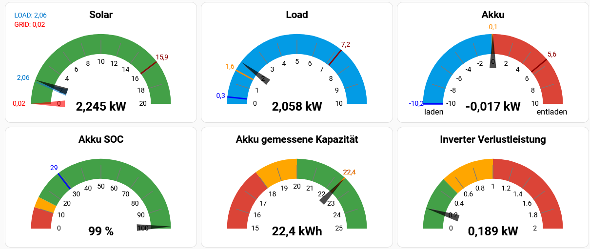

[](LICENSE)

# Custom Gauge Card for Home Assistant

A highly configurable and visually appealing SVG gauge card for Home Assistant dashboards, built with LitElement.

Displays a value from a sensor with custom styling, colored arcs, dynamic thresholds, and optional min/max/avg indicators based on statistics sensors.



---

## Features

* Custom min/max range
* Colored gauge arcs with gradient thresholds
* Animated needle
* Tick marks and labels
* Customizable needle color, opacity, and thickness
* Min/Max/Avg markers with values (requires statistics sensors)
* Multiple needles (e.g., for comparing values)
* Configurable formatting (decimals, separator, font sizes)
* Optional tap action (`more-info` by default)
* Optional hiding of needle for special values (e.g., battery full, overcharge)

---

## Installation

1. Copy `custom-gauge-card.js` into your `www/` directory inside Home Assistant config
2. Add to `configuration.yaml` or use the UI:

### yaml:
```yaml
resources:
  - url: /local/custom-gauge-card.js
    type: module
```

### UI:

Add the card as a resource in the Home Assistant UI:

   - Go to **Settings** → **Dashboards**.
   - Click the **⋮ (three dots)** in the top right corner → **Resources**.
   - Click **Add Resource**.
   - Enter the URL: `/local/custom-gauge-card.js`
   - Select **JavaScript Module** as the type.

3. Restart Home Assistant or reload resources

---

## Example Configuration (Lovelace)

### Minimal

```yaml
type: custom:custom-gauge-card
entity: sensor.load_power
min: 0
max: 1000
name: Load Power
```

### Full Example

```yaml
type: custom:custom-gauge-card
entity: sensor.load_power
name: Load Power
min: 0
max: 1000
gradient:
  "300": rgb(67, 160, 71)
  "700": orange
  "1000": red
tick_color: rgb(120, 120, 120)
tick_width: 1
ticks_count: 10
tick_stroke_inner: 0.5
tick_stroke_outer: 0.2
needle_color: black
needle_opacity: 0.7
titel_font_size: 15
value_font_size: 20
tick_font_size: 10
rltext_font_size: 12
decimal_separator: ","
decimals: 1
stat_decimals: 1
markers_width: 2
min_entity: sensor.load_power_minimum
max_entity: sensor.load_power_maximum
avg_entity: sensor.load_power_mittelwert
min_color: blue
max_color: red
avg_color: orange
grid_options:
  columns: 12
  rows: 4
tap_action:
  action: more-info
```

### Multiple Needles

```yaml
needles:
  - entity: sensor.load_power_today
    color: "#0077cc"
    opacity: 0.6
    show_value: true
    decimal: 2
  - entity: sensor.load_power_yesterday
    color: green
    opacity: 0.4
    show_value: true
    decimal: 1
```

## Example `sensor.yaml` entries for statistics:

```yaml
- platform: statistics
  name: Load Power Mittelwert
  entity_id: sensor.load_power
  state_characteristic: mean
  max_age:
    hours: 1

- platform: statistics
  name: Load Power Minimum
  entity_id: sensor.load_power
  state_characteristic: value_min
  max_age:
    hours: 1

- platform: statistics
  name: Load Power Maximum
  entity_id: sensor.load_power
  state_characteristic: value_max
  max_age:
    hours: 1
```

Make sure the base entity has `state_class: measurement` set in its attributes.

---

## Parameters

| Parameter           | Description                                     |
| ------------------- | ----------------------------------------------- |
| `entity`            | Main sensor to display                          |
| `name`              | Card title                                      |
| `min` / `max`       | Value range of the gauge                        |
| `gradient`          | Thresholds with colors (value: color)           |
| `ticks_count`       | Number of tick marks                            |
| `tick_color`        | Color of tick marks                             |
| `tick_width`        | Stroke width of ticks                           |
| `tick_stroke_inner` | Fraction inward (0.0–1.0)                       |
| `tick_stroke_outer` | Fraction outward (0.0–1.0)                      |
| `needle_color`      | Color of the main needle                        |
| `needle_opacity`    | Opacity of the needle (0.0–1.0)                 |
| `decimal_separator` | `,` or `.` for value display                    |
| `decimals`          | Decimals for main sensor value                  |
| `stat_decimals`     | Decimals for min/max/avg marker labels          |
| `markers_width`     | Line width of stat markers                      |
| `min_entity`        | Entity ID for min marker (optional)             |
| `max_entity`        | Entity ID for max marker (optional)             |
| `avg_entity`        | Entity ID for avg marker (optional)             |
| `min_color`         | Color of min marker                             |
| `max_color`         | Color of max marker                             |
| `avg_color`         | Color of avg marker                             |
| `titel_font_size`   | Font size of the title                          |
| `value_font_size`   | Font size of the main value                     |
| `tick_font_size`    | Font size for tick labels                       |
| `rltext_font_size`  | Font size for left/right labels                 |
| `tap_action`        | Tap interaction (`more-info`, `navigate`, etc.) |
| `needles`           | Array of additional needles                     |
| → `entity`          | Entity for the additional needle                |
| → `color`           | Color of this needle                            |
| → `opacity`         | Opacity (0.0–1.0)                               |
| → `show_value`      | Show value next to needle (true/false)          |
| → `decimal`         | Number of decimal places for value label        |

---

## Roadmap

* [ ] Optional pointer animations
* [ ] Shadow or glow for the needle
* [ ] Inner ring with progress bar style
* [ ] Optional background image behind gauge

---

## License

MIT License

Feel free to fork and improve this card. If you find it useful, a ⭐️ would be appreciated!

---

## Credits

Developed by [HeWeDe](https://github.com/HeWeDe) with support from ChatGPT 🤖

---

## Related Projects

* `mini-graph-card`
* `apexcharts-card`
* `button-card`

## 📁 Examples

The [`example/`](./example) folder contains real-world YAML snippets:

| File                | Description                                                   |
|---------------------|---------------------------------------------------------------|
| `configuration.yaml` | Base configuration with includes                              |
| `sensor.yaml`         | Statistics sensors for load, solar, battery, etc.            |
| `template.yaml`       | Example template sensor for inverter loss power              |
| `automations.yaml`    | Daily automation for battery capacity tracking               |
